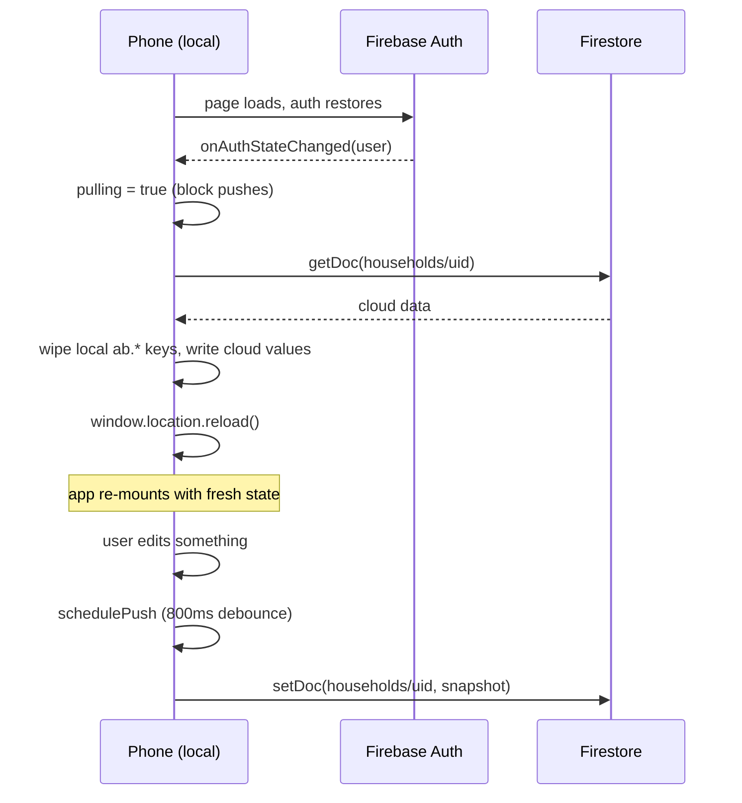
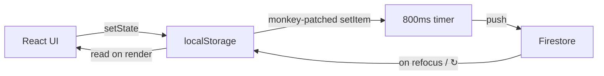
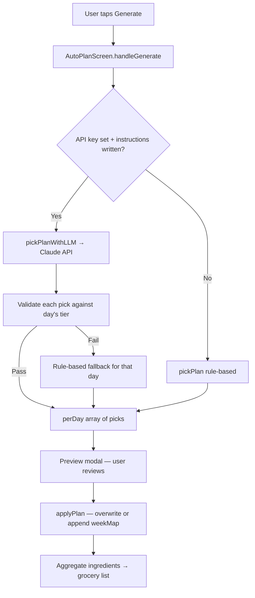
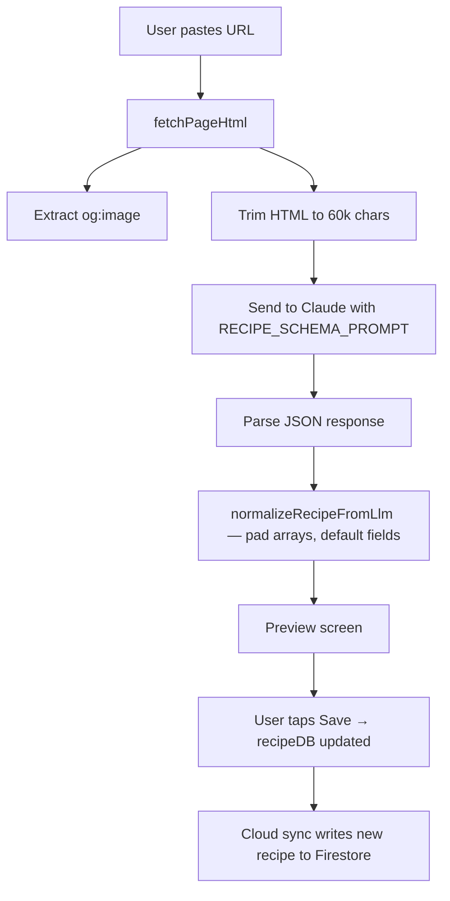

# Anderson Bites — Code Walkthrough

A plain-English map of `index.html` for non-coders. Read top-to-bottom once
to get the lay of the land, then keep it open as a reference when you (or
Claude) need to find or change something.

---

## What this app is, in one paragraph

Anderson Bites is a **single-file web app** — `index.html` is the whole
program. When you open it in a browser (or as a PWA on your phone), the
browser downloads that one file, plus a couple of icons and a `manifest.json`,
and that's enough to run the app. There's no server, no backend you control,
no app store. Your data lives in your browser's local storage on your phone,
and is mirrored to Google's Firestore so it syncs across your devices.

The fact that everything is in one HTML file is unusual. Most production
apps split themselves across hundreds of files. The single-file approach
trades tidiness for simplicity: you can read the whole thing top-to-bottom,
and there's nothing to "build" — the file you edit IS the file that runs.

---

## The big picture: how the file is organized

`index.html` has ~6000 lines arranged into seven "chapters." Each chapter
has a comment banner like `/* ═══ SCREEN: WEEK OVERVIEW ═══ */` so you can
search for one in your editor with Ctrl+F.

| Lines | Chapter | What it does |
|------|---------|--------------|
| 1–25 | **Head / PWA setup** | Page title, icons, links to manifest, marks the page as installable on iOS/Android. |
| 26–566 | **CSS (styling)** | Every color, font, border, and spacing rule. The "phone frame" appearance, dark theme, fonts, button styles. |
| 567–580 | **HTML body** | The 30-line scaffold the React app gets mounted into. The whole UI is built dynamically — this is just the empty stage. |
| 582–857 | **Cloud sync (Firebase)** | Sign-in, the `localStorage` ↔ Firestore mirror, pull-on-focus, push-on-change. Runs as a separate `<script type="module">` so it loads before the React app. |
| 859–2385 | **App logic (helpers + data)** | The "brain" of the app: persistence, image picking, recipe ingest from URLs/descriptions, the autoplan picker, default recipe library. |
| 2386–5790 | **Screens (React components)** | Every screen you tap through: Week, Grocery, Recipes, Recipe Detail, Add Recipe, Auto-Plan, Settings. |
| 5790–end | **App shell (navigation)** | The `App` component that wires all the screens together and holds the top-level state (recipes, weekly plans, grocery list, etc.). |

---

## Chapter-by-chapter, in plain English

### 1. Head / PWA setup — `lines 1–25`

This is browser metadata. Three things matter:

- **`<title>Anderson Bites — Meal Planner</title>`** — the tab title in
  desktop browsers.
- **`<link rel="manifest" href="manifest.json">`** — points Android/Chrome
  at the file that says "this site can be installed as an app, here's the
  icon and name."
- **`<meta name="apple-mobile-web-app-title" content="Bites">`** — iOS
  Safari **ignores** the manifest's name and reads this tag instead. So
  the iPhone home-screen label is set here, not in manifest.json. (Right
  now this says "Bites" — we should update it to "AndersonBites" too if
  you want consistency.)

The three `<script src="https://unpkg.com/...">` lines pull in React and
Babel from a free CDN. That's how this file can write modern React code
without any build step — Babel compiles it in the browser.

### 2. CSS / styling — `lines 26–566`

Pure visual styling. Nothing here affects logic — only what things look
like. A few notable spots:

- **`:root { --bg: #0d0d18; ... }`** (around line 30): the color palette.
  Change `--purple` here and every purple element in the app changes.
- **`.phone { position: fixed; inset: 0; ... }`** (around line 70): the
  outer container. This is the trick that fixes the iOS sizing bug —
  `inset: 0` pins it to all four edges of the visible viewport.
- **`.modal-backdrop` + `.modal-sheet`** (around line 411): bottom-sheet
  popups (the meal picker, confirm dialogs, etc.).
- **`.day-chip`, `.recipe-card`, `.meal-slot`, `.pill`, `.gen-btn`**: the
  visual building blocks of every screen.

You don't need to read this section to understand the app. Skim it once.

### 3. HTML body — `lines 567–580`

Just `

` plus two service-worker scripts. The whole
visible UI is built by React into that empty `
`.

### 4. Cloud sync — `lines 582–857`

The most "magical" part of the app, and the part most likely to have
subtle bugs. This is a separate `<script type="module">` that loads
**before** the React app so by the time the UI mounts, sign-in state
and any pulled cloud data is already in place.

What it does:

1. **`localStorage.setItem` is monkey-patched** (line ~669): every time
   any part of the app writes data to local storage (`ab.recipes.v4`,
   `ab.weekPlans`, `ab.groceryList`, etc.), the patched version also
   calls `schedulePush()` to queue a sync to Firestore.
2. **`schedulePush()`** (line ~663): debounces 800ms. Rapid edits get
   batched into one Firestore write.
3. **`pullFromCloud()`** (line ~678): reads the user's cloud doc and
   replaces local storage with it. Runs on sign-in, on app refocus
   (throttled to once/minute), and when you tap the ↻ button.
4. **`onAuthStateChanged`** (line ~734): Firebase tells us when sign-in
   state changes. We pull then.
5. **`flushPush()` + visibility/pagehide listeners** (line ~688, ~767):
   if the user backgrounds the app or refreshes while a debounced push
   is pending, fire it immediately.

The `initialPullDone` flag is critical: it blocks all pushes until the
first pull resolves. Without it, React's mount-time writes (every
`useEffect` saves state back to local storage on first render) would
race the pull and overwrite cloud with empty defaults.

### 5. App logic & data — `lines 859–2385`

This is the longest stretch. It's where the "intelligence" of the app
lives. Sub-sections:

#### 5a. Persistence helpers (lines ~868–1004)
- **`usePersistedState`** (line ~877): the React hook every screen uses
  to save and load state. Wraps `useState` + `useEffect` so any update
  is automatically written to local storage. Combined with the cloud
  sync above, that means every state change becomes a Firestore write.
- **Pantry classification** (lines ~887–1003): when the autoplan writes
  ingredients to the grocery list, it filters out "pantry staples"
  (salt, oil, etc.) so you don't end up with 50 obvious items every
  week. This section defines the default staple list and the rules
  that map any ingredient string to a single "concept" (so "kosher
  salt" and "sea salt" both collapse to "salt").

#### 5b. Image picker (lines ~1005–1031)
Recipe thumbnails. Tries the original og:image first (captured during
URL import), then Loremflickr (real Flickr photos tagged with the
recipe's keywords), then Pollinations (AI-generated as last resort),
then a static emoji.

#### 5c. Effort + helpers (lines ~1032–1142)
- `effortColor` / `effortLabel`: how "Light / Medium / Heavy"
  complexity is shown visually (green / amber / red).
- `recipePhotoSources`: orders the image candidates above.
- `recipeKeywords` / `recipeImageKeywords`: pulls search terms from
  the recipe name (or, for descriptions, from the user's typed text).

#### 5d. LLM helpers + autoplan picker (lines ~1143–2250)
The biggest sub-section and the most interesting. Three parts:

- **`RECIPE_SCHEMA_PROMPT`** (line ~1146): the long instruction we
  send to Claude when ingesting a recipe from a URL or description.
  Tells Claude exactly what JSON shape to return and exactly which
  rules to apply (preserve qty verbatim, copy steps verbatim,
  classify complexity, pick the right tags).
- **`callClaude`** (line ~1196): the actual API call to Anthropic.
- **Autoplan logic** (lines ~1500–2250): two pickers that decide
  which dinner goes on which day. **`pickPlanWithLLM`** asks Claude
  for picks and validates them against the day's tier. **`pickPlan`**
  is the rule-based fallback when no API key is set. Both honor the
  same tier model:
  - `tier='breakfast'` (day has breakfast prep) → **Light** dinner
  - `tier='task'` (day has laundry/etc., no breakfast) → **Medium**
    dinner, **Light** as fallback, **no Heavy**
  - `tier='free'` (nothing on the day) → **Medium or Heavy**, no Light

#### 5e. Default data (lines ~2251–2385)
- `GROCERY_ITEMS`: sample grocery list (only used for a brand-new
  install with no cloud doc).
- `RECIPES_DATA` (huge!): the starter recipe library — every recipe
  that ships with the app. New recipes you add via URL or description
  go alongside this in cloud-synced state.

### 6. Screens — `lines 2386–5790`

Each "screen" you tap through is a separate React component, named
after what it shows. Order in the file is roughly the order you'd
encounter them:

| Lines | Component | What it is |
|------|-----------|------------|
| 2386–2525 | Shared components | `TabBar` (bottom nav), `Toggle`, small reusable bits. |
| 2526–3087 | **WeekScreen** | The Week tab — day chips at top, the selected day's meals + tasks below. Tapping a meal slot opens `RecipeSheet`. |
| 3088–3784 | **GroceryScreen** | The Grocery tab — items grouped by category, check-off, the trash-can clear-all, add-manual input, LLM-driven categorization. |
| 3785–3821 | `CloudRefreshButton` | The ↻ icon that does a manual force-pull. |
| 3822–4149 | **RecipesScreen** | The Recipes tab — searchable library, filter pills, tap to open detail. |
| 4150–4530 | **AddRecipeScreen** + URL/Describe variants | "How would you like to add a recipe?" → "Paste a URL" / "Type a description" flows. |
| 4531–4906 | **RecipeDetailScreen** | One recipe — hero image, ingredients, steps, with the Ingredients/Steps toggle. |
| 4907–5790 | **AutoPlanScreen** | The fourth tab — day picker, breakfast rotation, recurring tasks, custom instructions, the big Generate button, preview modal, apply-as-overwrite-or-append. |

### 7. App shell (top-level state + navigation) — `lines 5790–end`

The `App` component at the bottom of the file is what React mounts
into the page. It holds all the top-level state (current tab, current
recipe selection, recipe library, weekly plan map, grocery list, etc.)
and decides which screen to render based on which tab is active and
which "subscreen" (e.g. recipe detail) is open.

Every screen above receives its data and update functions from `App`
as props. Think of `App` as the wiring panel — it doesn't draw
anything itself, it just decides what to show and gives each screen
what it needs.

---

## How data flows: the three diagrams

### Cloud sync (covered above too)

### Autoplan generate flow

### Recipe import flow

---

## "Where do I find X?" — quick index

| I want to change... | Look around line... |
|---|---|
| Color palette (purples, dark background) | 30 (`:root` CSS) |
| Default font | 33 (`--font` CSS) |
| Bottom tab bar (icons / labels) | search `TabBar` |
| Week tab — day chip styles | search `day-chip` in CSS, ~line 250 |
| Week tab — meal slot styles | search `meal-slot` in CSS |
| Recipe import behavior (what Claude is told) | 1146 (`RECIPE_SCHEMA_PROMPT`) |
| Default pantry staples list | 887 (`DEFAULT_PANTRY`) |
| Starter recipe library | 2277 (`RECIPES_DATA`) |
| Autoplan tier rules | 1745 (helpers) + 1870 (LLM prompt) |
| Grocery list categories | search `cat:` in `GROCERY_ITEMS` and the LLM categorizer |
| Cloud sync debounce timing | 663 (`schedulePush`, 800ms) |
| What gets synced to cloud | 611 (`SKIP_PREFIXES` says what does NOT) |
| Effort labels (Light/Medium/Heavy) | search `effortLabel` |
| Recipe detail layout | 4534 (`RecipeDetailScreen`) |

---

## Glossary

Terms I might use that don't have an obvious plain-English meaning:

- **React component**: a function that returns a chunk of UI. Each screen
  is a component. Components can contain other components.
- **State**: a value the app remembers that can change. The grocery list
  is state. The currently-selected tab is state. When state changes, the
  UI re-renders automatically.
- **Hook**: a special function React provides starting with `use`
  (`useState`, `useEffect`, `usePersistedState`). They let components
  remember things and react to changes.
- **Props**: values passed from a parent component to a child. `App`
  passes `recipeDB` and `setRecipeDB` to `RecipesScreen` as props —
  that's how the screen gets access to the data and how it can update it.
- **localStorage**: a browser feature that stores key/value strings
  per-site, persists across reloads. ~5MB limit. Our cloud sync
  basically mirrors this to Firestore.
- **Firestore**: Google's cloud database. Each user has one document
  at `households/<their-uid>` that holds all their data as a single
  JSON blob.
- **Debounce**: "wait until edits have stopped for X milliseconds, then
  do the action." Stops every keystroke from triggering a separate
  cloud write.
- **PWA**: Progressive Web App. A website that browsers can install as
  a standalone app icon on your home screen, with offline support.
- **Manifest**: `manifest.json` — tells the browser the app's name,
  icon, and display mode when installed as a PWA.
- **Module / babel script**: just a flavor of `<script>` tag with
  different capabilities. The cloud-sync block is a module so it can
  `import` Firebase. The React code is babel-compiled so it can use
  JSX syntax (HTML inside JavaScript).
- **Service worker**: a tiny background script the browser runs even
  when the page is closed. Used here to enable PWA offline mode.

---

## How to read this file in an editor

If you're in VS Code, Cursor, or any modern editor:

- **Ctrl+G** then a number jumps to that line. So if this doc says
  "around line 3567," `Ctrl+G 3567 Enter` takes you there.
- **Ctrl+F** finds text. Search for `function GroceryScreen` to jump
  to that component's start.
- **Outline panel** (left sidebar): shows the file's structure as a
  list of functions and components. Click any to jump.
- **Ctrl+/** comments / uncomments a line. Useful if you want to
  temporarily disable something.
- **Word wrap** (Alt+Z in VS Code): toggles whether long lines wrap.
  This file has lots of long lines — wrap is usually nicer.

If you want to **never break the file**, the safest workflow is:
1. Before changing anything, make sure you're on a clean commit
   (everything in `git status` says "working tree clean").
2. Make your change.
3. Refresh the local server (the PowerShell window running
   `serve.ps1`) and check the app in the browser.
4. If it broke: `git checkout index.html` reverts your change instantly.
5. If it worked: commit and push as usual.

---

This document is a starting point. After we walk through it together,
I'll update sections that weren't clear and add anything that was
missing.
